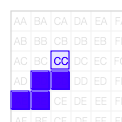
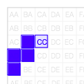

# COMP1140 Assignment 2

*This assignment is only for those enrolled in COMP1140.  COMP1110, COMP1510, and COMP6710 students should look [here](https://gitlab.cecs.anu.edu.au/comp1110/comp1110-ass2).*

## Academic Honesty and Integrity

Honesty and integrity are of utmost importance. These goals are *not* at odds with being resourceful and working collaboratively. You *should* be resourceful, you should collaborate within your team, and you should discuss the assignment and other aspects of the course with others taking the class. However, *you must never misrepresent the work of others as your own*. If you have taken ideas from elsewhere or used code sourced from elsewhere, you must say so with *utmost clarity*. At each stage of the assignment you will be asked to submit a statement of originality, either as a group or as individuals. This statement is the place for you to declare which ideas or code contained in your submission were sourced from elsewhere.

Please read the ANU's [official position](http://academichonesty.anu.edu.au/) on academic honesty. If you have any questions, please ask me.

Carefully review the [statement of originality](originality.md) which you must complete.  Edit that statement and update it as you complete each state of the assignment, ensuring that when you complete each stage, a truthful statement is committed and pushed to your repo.

## Purpose

In this assignment you will exercise a number of major themes of the course, including software design and implemention, using development tools such as Git and IntelliJ, using JavaFX to build a user interface.   The assignment will also give you the opportunity to apply some AI to your game, and make the most of the [1140 guest lecture given by Steve Gould](http://cs.anu.edu.au/courses/COMP1110/lectures.html#G3). Above all, this assignment will emphasize group work.

## Assignment Deliverables

The assignment is worth 25% of your total assessment, and it will be marked out of 25. So each mark in the assignment corresponds to a mark in your final assessment for the course. Note that for some stages of the assignment you will get a _group_ mark, and for others you will be _individually_ marked. The mark breakdown and the due dates are described on the [deliverables](http://cs.anu.edu.au/courses/COMP1110/deliverables.html) page.

Your work will be marked via your tutor accessing git, so it is essential that you carefully follow instructions for setting up and maintaining your group repository. At each deadline you will be marked according to whatever is committed to your repository at the time of the deadline. You will be assessed on how effectively you use git as a development tool.

## Problem Description

The assignment centers on the popular board game [blokus](https://en.wikipedia.org/wiki/Blokus), designed for two to four players, created by [Bernard Tavitian](http://www.exodusbooks.com/author.aspx?id=2895).  The objective of the game is place tiles ([polyominos](https://en.wikipedia.org/wiki/Polyomino#Enumeration_of_polyominoes)) on a board according to a simple set of rules governing where pieces may be placed.  Blokus is a strategy game; careful placement of the tiles is important to winning the game.   Your assignment is to first build a playable version of the game (for two to four players), and having done that, to write an agent capable of playing a reasonable game of blokus against one to three human players.

### Game Play

Gameplay is concisely described on [Wikipedia](https://en.wikipedia.org/wiki/Blokus):

---
The game is played on a square board divided into 20 rows and 20 columns, for a total of 400 squares. There are a total of 84 game tiles, organized into 21 shapes in each of four colors: blue, yellow, red, and green. The 21 shapes are based on free polyominoes of from one to five squares (one monomino, one domino, two [trominoes/triominoes](https://en.wikipedia.org/wiki/Tromino), five [tetrominoes](https://en.wikipedia.org/wiki/Tetromino), and 12 [pentominoes](https://en.wikipedia.org/wiki/Pentomino)).

The standard rules of play for all variations of the game are as follows:

* Order of play is based on color, with blue going first, followed by yellow, red, and green.</li>
* The first piece played of each color is placed in one of the board's four corners. Each new piece played must be placed so that it touches at least one piece of the same color, with only corner-to-corner contact allowed—edges cannot touch. However, edge-to-edge contact is allowed when two pieces of different color are involved.</li>
* When a player cannot place a piece, he or she passes, and play continues as normal. The game ends when no one can place a piece.

When a game ends, the score is based on the number of squares in each player's unplayed pieces; a player loses one point for each square (e.g. a tetromino is worth -4 points). If a player played all of his or her pieces, he or she gets a bonus score of +20 points if the last piece played was a monomino, +15 points otherwise.

---

The official rules can be found  [here](http://www.boardgamecapital.com/game_rules/blokus.pdf).  The [official website](http://www.mattelgames.com/en-us/blokus/index.html) includes a [video](https://youtu.be/9LDM0xFDCFY) description of the game.
 
### Encoding Game State

The state of a game can be encoded as a string.   Your game will need to be able to initialize itself from such strings.  Strings are used by the testing framework.   A game state string encodes a series of moves.   The string starts with the first move by blue, then progresses to yellow, red and green, and so on (following the order of play specified in  the [official rules](http://www.boardgamecapital.com/game_rules/blokus.pdf)).   For each move, the string encodes *either* the tile played, or a dot `.` which represents the player having ceased playing. Once a player has ceased playing, they must remain out of the game, playing a `.` for every subsequent turn.   The game finishes when all players have ceased, either by successfully playing all of their pieces or by playing a `.`.

Tiles are encoded as *four* letters.   The **first** letter identifies the polyomino, with letters `A` to `U` representing tiles in the order defined in Figure 1 of the [official rules](http://www.boardgamecapital.com/game_rules/blokus.pdf), with `A` representing the monomino (numbered 1 in the rules), and `U` representing the `+`-shaped pentomino (numbered 21 in the rules).   The **second** letter encodes the orientation of the tile, with `A`, `B`, `C` and `D` representing  0&deg;, 90&deg;, 180&deg;, and 270&deg; rotations with respect to the depictions in Figure 1 of the rules.  `E`, `F`, `G`, and `H` represent the 0&deg;, 90&deg;, 180&deg;, and 270&deg; rotations of the tiles *after*  a flip along the vertical axis. Note that for many of the tiles, some or even all of the rotations and flips are isomorphic (for example, the symmetry of tiles `A` and `H` mean that they are unaffected by any change in orientation).  The **third** letter encodes the placement of the *origin* of the tile in the horizontal direction, with letters `A` through `T` representing the 20 columns of the board.  The **fourth** letter encodes the placement of the *origin* of the tile in the vertical direction, with letters `A` through `T` representing the 20 rows of the board.  The **origin** of the tile is defined as the top-left-most square of the tile in its *original* (`A`) orientation, as depicted in the [official rules](http://www.boardgamecapital.com/game_rules/blokus.pdf).

This is illustrated below  (with tile `A` at top left, then `B`, `C`, etc., across the top row, continuing left-to-right, top-to-bottom, finishing with tile `U`).  Each tile is shown in its original `A` orientation.  For the sake of illustration, the *origin* is shaded light blue and has the square location marked in it.

The following table illustrates the `R` tile at location `CC`, under all eight orientations.

|RACC|RBCC|RCCC|RDCC|RECC|RFCC|RGCC|RHCC|
|:--:|:--:|:--:|:--:|:--:|:--:|:--:|:--:|
|      |      |      |     |      |      |      |     |

Notice that there are often many ways to encode the placement of a piece.  For example, the piece placement `RDCC` could  equivalently be encoded as `REEA`.   Notice that of the above tile placements, only `RCCC` and `RFCC` are legal first moves for blue (which must start with a piece covering the square `AA`).   The only other legal placements of the `R` piece in an opening move for blue are `RAAA` and `RHAA` (not shown).

The following encodes and illustrates the game depicted in Figure 5 of the  [rules](http://www.boardgamecapital.com/game_rules/blokus.pdf):

`RCCC RBTA SARR SBCR SHDD TBQD RAOO PBFP LBJH LHLH LGNN TAGN JDKI JBRA OHIM UAHK KDGJ KAPH JARK JAFG UADG UALA UASH QAGD QDCL PCIC MEQE MEBL DDKL MDRE TGJQ OHID EBFA QDON PAIR KBGT IBMM SHMO KDDR RCDK GCFO NAPR QCCQ IDAH FHKQ IHRP FATN LDAD NBIP OHJR DBEM FFFB PBMF BASN AAHN DBBP THMC FGTM BBSD AAME OBRB EBNJ . BBOF MHFC CBJI . . HANR DAHD . . CBMT AAGH . . BBBK . . . AACF`

Once again, in this picture the origin of each piece is shaded transparent and has the location printed in it, just to make the piece placement completely clear for the sake of describing our encoding (unnecessary and distracting in the case of the working game).

### Legal Game State

The [rules](http://www.boardgamecapital.com/game_rules/blokus.pdf) explain that a legal move requires that each new piece must touch at least one other piece of the same color, but only at the corners (not along their edges).  Your game will need to check for and enforce correct placement of pieces.

## Legal and Ethical Issues

First, as with any work you do, you must abide by the principles of [honesty and integrity](http://academichonesty.anu.edu.au). I expect you to demonstrate honesty and integrity in everything you do.

In addition to those ground rules, you are to follow the rules one would normaly be subject to in a commercial setting. In particular, you may make use of the works of others under two fundamental conditions: a) your use of their work must be clearly acknowledged, and b) your use of their work must be legal (for example, consistent with any copyright and licensing that applies to the given material). *Please understand that violation of these rules is a very serious offence.*  However, as long as you abide by these rules, you are explicitly invited to conduct research and make use of a variety of sources. You are also given an explicit means with which to declare your use of other sources (via originality statements you must complete). It is important to realize that you will be assessed on the basis of your original contributions to the project. While you won't be penalized for correctly attributed use of others' ideas, the work of others will not be considered as part of your contribution. Therefore, these rules allow you to copy another student's work entirely if: a) they gave you permission to do so, and b) you acknowledged that you had done so. Notice, however, that if you were to do this you would have no original contribution and so would recieve no marks for the assigment (but you would not have broken any rules either).

The Blokus game was developed by [Bernard Tavitian](http://www.exodusbooks.com/author.aspx?id=2895) and is now owned by [Mattel](https://en.wikipedia.org/wiki/Mattel).   The Blokus trademark is property of its trademark holder.

## Evaluation Criteria

It is essential that you refer to the [deliverables page](http://cs.anu.edu.au/courses/COMP1110/deliverables.html) to check that you understand each of the deadlines and what is required.   Your assignment will be marked via git, so all submittable materials will need to be in git and in the *correct* locations, as prescribed by the [deliverables page](http://cs.anu.edu.au/courses/COMP1110/deliverables.html).

### Part One

Design an implementation the game, _ignoring the graphical user interface for now_. Use UML to model your design (use [https://umbrello.kde.org](https://umbrello.kde.org) to make a pdf).  You should add your .xmi file to your repo, in addition to the pdf that is required by the deliverables.

Start with a text-only implementation of your system which uses the class `comp1140.ass2.BlokGame` to satisfy the the criteria below.

**Pass**
* Appropriate use of git (as demonstrated by the history of your repo).
* Successfully implement `BlokGame.legitimateGame()`.

**Distinction**
* All of the Pass-level criteria, plus...
* Successfully implement `BlokGame.scoreGame()`.
* Successfully implement `BlokGame.makeMove()` (it should be functionally correct, but it need not make good moves).

### Part Two

Create a fully working game, using JavaFX to implement a playable graphical version of the game in a 700x700 window.   The requirement that the game play within a 700x700 window is a significant (but not unrealistic) constraint on your GUI design.

Notice that aside from the size of the window, the details of exactly how the game looks etc, are intentionally left up to you.  The diagrams above are for illustration purposes only.   You have a great deal of freedom in terms of the look and feel of the game.  The only firm requirements are that you use Java and JavaFX, that it respects the specification of the game given here, that it be easy to play, that it run in 700x700 window, and that it is executable on a standard lab machine from a jar file called `game.jar`. Your game must successfully run from `game.jar` from within another user's (i.e. your tutor's) account on a standard lab machine (in other words, your game must not depend on features not self-contained within that jar file and the Java 8 runtime).

**Pass**
* Appropriate use of git (as demonstrated by the history of your repo).
* A working implementation of a basic Blokus game implemented in JavaFX (supporting just the normal four players).
* Executable on a standard lab computer from a runnable jar file, `game.jar`, which resides in the root level of your group repo.
* Successfully implements `BlokGame.legitimateGame()` and during the game prevents the player from making illegal moves.
* Successfully implements `BlokGame.scoreGame()`, and correctly presents the score for the game.

**Credit**
* _All of the Pass-level criteria, plus the following..._
* The game supports two, three, and four human players, following the suggestions in the [rules](http://www.boardgamecapital.com/game_rules/blokus.pdf) for two and three player games.
* Successfully implements `BlokGame.makeMove()`,  providing an basic computer opponent (need not be a strong player).

**Distinction**
* _All of the Credit-level criteria, plus the following..._
* The game allows a single player to play the *eighty four* game described in the [rules](http://www.boardgamecapital.com/game_rules/blokus.pdf).
* The game identifies all unplayable pieces when a turn is being taken (the unplayable pieces could be dimmed, indicating to the player that they are unplayable).  An unplayable piece is one that can't possibly be used in the given game state.   A given player's game ends once all of their unplaced tiles are unplayable.

**High Distinction**
* _All of the Distinction-level criteria, plus the following..._
* The game implements a good computer opponent.

